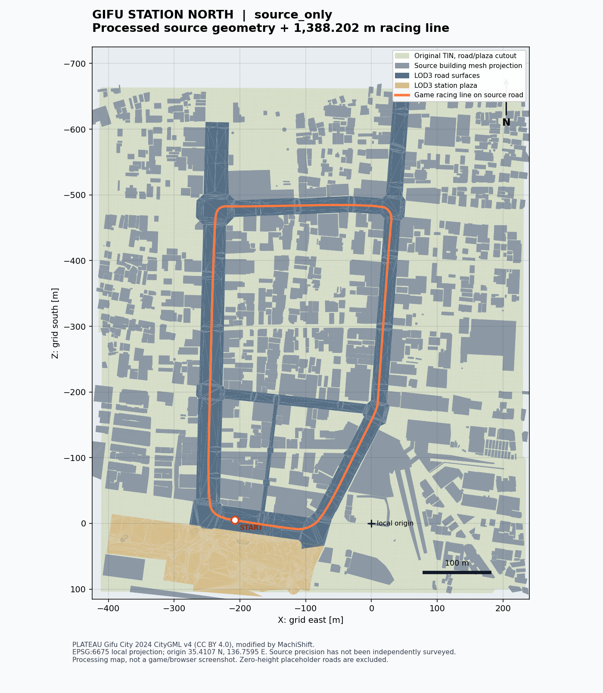

# 岐阜駅北口の実在データ

このステージは **岐阜市 2024年度 PLATEAU CityGML v4 の実際のポリゴン**から生成しています。手作りの建物箱、道路の拡幅、実在しない坂による代用は行っていません。状態は `source_only` です。独立した測量・現地写真との比較を行っていないため、道路端 ±30 cm、段差 ±5–10 cm、建物 ±1 m の受入条件は未検証です。



この図は、取得・変換した地形、道路、建物メッシュを正しいメートル座標に投影した処理確認用の平面図です。ゲームのブラウザースクリーンショットではありません。測量済み・外観照合済みという意味もありません。

## 取得・変換結果

| 項目 | 実施結果 |
| --- | --- |
| 原本 | [岐阜市 2024年度 PLATEAU](https://www.geospatial.jp/ckan/dataset/plateau-21201-gifu-shi-2024) の CityGML ZIP |
| 原本 ZIP サイズ | 4,284,751,077 byte |
| 取得方法 | HTTP Range で ZIP64 中央ディレクトリと対象メンバーを取得。ZIP 全量は取得していない |
| 地域メッシュ | 建物・道路は 53360690 / 53360691、広場・橋・都市設備は 53360690 |
| 配信地物 | 道路 LOD3 57、道路 LOD1 292、広場 LOD3 1、建物 LOD2 1,343 / LOD1 4、橋 LOD3 2、都市設備 LOD3 3,121 |
| 配信形状 | 道路・建物・都市設備等は 302,563 三角形。地形 33,984 三角形を加え、合計 336,547 三角形 |
| 区画 | 200 m 格子。都市地物 25 区画、地形 25 区画。都市地物は切断せず、実際の bounds も格納 |
| AOI | ローカル X −410〜230 m、Z −710〜100 m、約 0.518 km²。境界に交差する元ポリゴンは全体を維持 |
| 周回線 | 1,388.202 m、378 点、閉ループ。ゲーム用に選んだ走行線であり実在の道路中心線とは称しない |
| 路面との関係 | 全 378 点の高さを包含する元 LOD3 道路三角形から求める。最短境界距離 9.360 m |
| 圧縮 | `gzip`、mtime=0。最終 50 個で 14,284,849 byte。個別サイズ・SHA-256 は stage.json |

`data/provenance.json` に、不変の各 ZIP メンバーの元ファイル名、URL、圧縮サイズ、CRC32、SHA-256、取得日時を記録しています。全 ZIP の SHA-256 は未取得と明記しています。中央ディレクトリの SHA-256 と各メンバーの CRC32 / SHA-256 を、全 ZIP ハッシュの代わりと偽ってはいません。

元ファイルは `data/raw/` に保持し、Git およびブラウザー配信には含めません。取得直後のメモリーだけでなく、ディスクに保存されたサイズ・CRC32・SHA-256 を照合します。実行環境で大きい書き込みが途中までとなった都市設備 GML は、再取得・分割書き込み・再照合により修復しました。

## 座標・高さ・表面

原本 CRS は EPSG:6697（JGD2011 の緯度・経度と標高）。水平成分を EPSG:6675（JGD2011 平面直角座標系 VII）へ変換し、原点 `[緯度35.4107, 経度136.7595, 標高0]` を差し引きます。1 単位=1 m、+X=東、+Y=原本の標高、−Z=北です。緯度経度を直接距離として扱いません。高さを楕円体高へ変換していません。

保存時の 1 mm 丸めは容量と数値表現のための桁数であり、1 mm の位置精度を意味しません。`cityLod` は原データの都市モデル LOD、`renderLod` は描画用加工状態です。

**原本 LOD1 / LOD2 道路の高さは 0 のプレースホルダーです。** これらは `heightStatus: source_placeholder_zero`、`runtimeEligible:false` として区別し、ゲームの描画・衝突に使いません。記録自体は出典台帳と派生データに残します。周回線には標高 10.386〜12.992 m の実際の LOD3 道路面だけを採用しました。各地物内では最も高い LOD を使用し、低い LOD との重複を避けています。

道路・広場・デッキ・家具は別の物体・面です。橋を地上と同じ一枚の平面へ潰していません。元の `gml:id` は `sourceId`、元のポリゴン ID は `surfaces[].sourceId` へ保持し、面のインデックス範囲と逆引きできます。`gameAdded:false` の原本地物とレース用の追加物を区別します。

`public/data/route-evidence.json` は各走行線点の包含三角形、元道路 ID、高さ、境界距離を記録します。この検査は **変換モデル内での路面支持の確認**であり、独立測量による位置精度検証ではありません。車幅・他車・街路設備との干渉および実際の完走は、物理走行テストの別の責務です。

## 出典と利用条件

原本 `README.md`（作成日 2025-02-20）は、利用者が CC BY 4.0 等のいずれかを選べると明示しています。本派生地物データには **CC BY 4.0** を選択しました。ソースコードのライセンスとは別です。[現在の PLATEAU サイトポリシー](https://www.mlit.go.jp/plateau/site-policy/)も確認し、現在は PDL1.0 準拠・CC BY 4.0 互換であること、出典および加工表示が必要であることを記録しました。

表示する帰属は次の内容です。

> 岐阜市 3D都市モデル（Project PLATEAU）を加工して作成。地物の切り出し・座標変換・三角形分割：MachiShift。自治体の公式ゲームではありません。

データセット年度は 2024 年度ですが、原典資料 CSV は属性ごとに 2019〜2024 年等の異なる年度・取得方法を列挙しています。各地物の現況を 2026 年に測量したものと扱いません。原本 README の作成日、地物の creationDate、ZIP 更新日時、撮影・測量年月も別の値です。

### 原本 PDF の確認範囲

同じ原本 ZIP から `21201_indexmap_op.pdf`（5,284,600 byte、8 ページ）と `specification/21201_city_2024_specification_op.pdf`（22,715,186 byte、752 ページ）も取得し、保存後の SHA-256・CRC32・サイズを照合しました。原本取得台帳は現在 17 メンバーです。

索引図は全 8 ページを画像化して確認しました。採用した 53360690 / 53360691 のメッシュを確認できますが、凡例は建物 LOD1 / LOD2 の整備範囲を示しており、これだけで周回線全域の道路 LOD3 を証明しません。PDF の作成メタデータは 2024-03-01 であり、測量年月とは扱いません。

仕様書は全 752 ページを取得し、対象に関係する **PDF 通しページ 1、11、12、173、175、701、716、717、724、734** を画像で確認しました。第 4.1 版の標準製品仕様書を参照していること、製品日付 2025-02-20、地物と LOD の対応、道路 LOD1 の高さを 0 とする定義、東京湾平均海面を基準とする標高と EPSG:6697、地物 ID、品質要求を照合しました。地図情報レベル 2500 の水平 1.75 m / 標高 0.66 m は、抜取検査の標準偏差に関する基準であり、全地点の最大誤差やゲームのセンチメートル精度を保証しません。

752 ページ全体の条項適合をレビュー済みとはしていません。確認したページ・取得ハッシュ・範囲外の事項は `data/document-review.json`、実際に見た 18 枚のページ画像は `docs/evidence/source-documents/` にあります。原本仕様書の確認と、独立測量・現地近景の確認は別の作業です。

テクスチャは配信に含めていません。元画像の近景品質・広告・作品等の個別確認、UV 対応、現地写真との固定視点照合は残作業です。単色の素材表示を「写真と見分けがつかない」と評価していません。

地形は取得済みの実際の TIN 1,756,078 三角形を走査し、AOI に交差する 32,047 元三角形を抽出しました。LOD3 の道路・広場の平面領域を地形から切り抜くことで、二つの異なる原典高さの面が道路上に重なって衝突することを防ぎます。切り口の新頂点は元の TIN 三角形平面に内挿し、高さを平滑化・ゼロ化・路面へ移動していません。面積境界に沿った切り取りは加工履歴へ記録しています。元の TIN に三角形ごとの gml:id がないため、親 TIN の gml:id と元三角形の走査序数を対応 ID とし、生成した ID であることを明示しています。路面・広場の外に架空の無限地面を地理モデルとして追加しません。

## 再生成

```bash
python -m venv .venv-geodata
.venv-geodata/bin/pip install -r scripts/geodata/requirements.txt
.venv-geodata/bin/python scripts/geodata/download.py
.venv-geodata/bin/python scripts/geodata/download.py --members README.md codelists/CityFurniture_function.xml codelists/CityFurniture_class.xml udx/dem/533606_dem_6697_op.gml
.venv-geodata/bin/python scripts/geodata/download.py --members 21201_indexmap_op.pdf specification/21201_city_2024_specification_op.pdf
.venv-geodata/bin/python scripts/geodata/convert.py
.venv-geodata/bin/python scripts/geodata/route.py
.venv-geodata/bin/python scripts/geodata/terrain.py
.venv-geodata/bin/python scripts/geodata/pack.py
.venv-geodata/bin/python scripts/geodata/inventory.py
.venv-geodata/bin/python -m unittest discover -s scripts/geodata -p 'test_*.py'
.venv-geodata/bin/python scripts/geodata/audit.py
```

初回は `curl` と約 2 GB 以上の作業空き容量、配布元へのネットワーク接続が必要です。原 ZIP 全量を取得しませんが、地形原典だけで展開後約 629 MB あります。通常のアプリ CI は同梱済みの圧縮派生物を使い、数 GB の取得を繰り返しません。

URL・元サイズ・CRC が変わった場合、取得スクリプトは不一致を失敗として扱います。ファイルを成功に見せる代替地物を生成しません。配布元の更新を再確認した上で、取得設定・出典記録・受入証跡を更新してください。

## 欠損・未検証

- 独立した道路 10 断面、主要建物 20 地点の照合：未実施。`docs/survey-plan.md` と `data/survey-plan.json` に実地収集対象を記載。
- 路面標高 0 の範囲：未測高として区別。地形との照合・補修により自然につながるとは未確認。
- 壁面テクスチャ、低層部の建具・看板・広告等の近景確認：未実施。
- 製品仕様書全 752 ページの条項適合点検：未実施。原本仕様書・索引図の取得、索引図全 8 ページと対象に関係する仕様書 10 ページの画像確認は実施済み。
- 実物の柵・ベンチの状態、歩車道境界・屋根下の通行可能高さ：現地未確認。物理走行結果と地理精度の検証を混同しない。

これらが残るため、実データの取得・変換が済んでいても Gate A 全体および GEO 精度要件を総合 PASS にしません。
